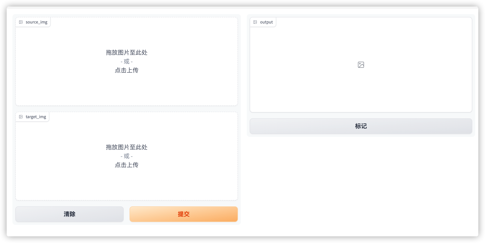

# insightface-swap

A browser interface based on Gradio library for Insightface Swap.




### Installation

1.``pip install -r requirements.txt``

2.download [model](https://drive.google.com/file/d/1vnZNrSjAbOfIBUAe3FbTDGZUDfJbM4gM/view?usp=sharing) put in **models** directory

### Running
```shell
python main.py
```